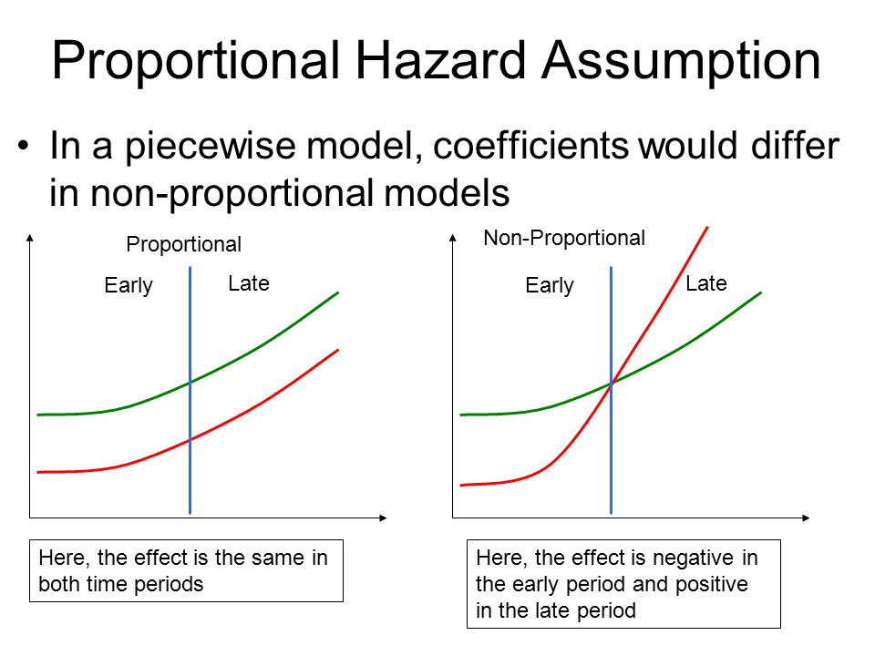

# Survival Regression to Predict Customer Churn

```{r}
#| include: false
# http://www.altis.com.au/a-crash-course-in-survival-analysis-customer-churn-part-iii/
#
```

```{r}
#| include: false
# Needed modules
library(ggplot2)
library(gridExtra)
library(ggthemes)
library(eha)
library(survival)

telco <- readRDS("data/telco.rds")
telco2 <- readRDS("data/telco2.rds")
```

[Understanding customer tenure]{.smallcaps} is valuable, but to truly manage churn, we need to identify the covariates that influence it. For this purpose, we use Cox Proportional Hazards (PH) regression, a statistical model that allows us to analyze how various customer-specific covariates impact the hazard of churn.

The **hazard ratio** is not the same as **probability** or the **odds**.

A hazard ratio is a relative measure. If a covariate has a hazard ratio of 1.10, it means that a customer with that characteristic has a (1.10 - 1) 0.10 or 10% higher instantaneous risk of churning at any given moment, when holding all other covariates constant (*ceteris paribus*).

The primary output of a Cox Proportional Hazards model is the regression coefficients. Exponentiating these coefficients gives us the hazard ratios, which quantify the relative risk of an event (in this case, churn).

Let's say we've fitted a Cox regression model with contract as a covariate, coded as 1 for Yes and 0 for No.

If the hazard ratio for contract is 1.10, it means that at any given time, No have a 1.10 times higher hazard of churn compared to Yes, holding all other covariates constant. This translates to No being 10% more likely to churn than Yes.

The key to interpreting hazard ratios is a comparison to 1:

- Hazard Ratio > 1: this means the covariate increases the hazard of the event. For example, a hazard ratio of 1.50 means the hazard is 50% higher for a one-unit increase in the covariate, holding all other covariates constant.
- Hazard Ratio < 1: this means the covariate decreases the hazard. A hazard ratio of 0.75 indicates a 25% reduction in hazard for a one-unit increase, holding all other covariates constant.
- Hazard Ratio = 1: this means the covariate has no effect on the hazard.

## Proportional Hazards Assumption

Cox models rely on a fundamental assumption known as proportional hazards. This assumption states that the hazard ratio for all covariates remains constant over time.

This concept can be understood by looking at the Weibull model's shape parameter. Because there is only one $\lambda$ coefficient, it defines a single hazard shape for the entire baseline. This ensures that the effect of any covariate is a simple multiplicative factor, making the hazard ratios proportional by definition.

For example, consider the covariate `Dependents` (1 if the customer has children, 0 otherwise). If the proportional hazards assumption holds, the hazard ratio for this covariate would be consistent. This means that at any point in time -- whether it has been 6 months or 12 months since the customer signed up -- the relative difference in churn risk between those with and without children is the same.

{fig-label="PH Assumption." width=100% #fig-ph}

As shown in @fig-ph, we are examining two different scenarios for hazard functions.

On the left, the parallel lines represent a proportional hazard. This means that while the hazard for each group may change over time, the ratio of the hazards between the two groups remains constant. For example, the hazard for customers with `Dependents` (red line) is always a fixed multiple of the hazard for the other group. This is the assumption that the Weibull model and other Cox models rely on. With a decreasing hazard function, we can expect a survival curve that decreases and then flattens out over time, similar to what's seen in @fig-weibull.ph.model.1.

On the right, the lines are not parallel. This represents a scenario where the proportional hazards assumption is violated, meaning the hazard ratio between the two groups changes over time. With an increasing hazard over time, the survival curve would plunge more steeply over time, rather than flattening out. These kinds of plunging survival curves are often seen in health sciences, such as when observing the survival rate of cancer patients over time.

A statistical test can be used to formally check the proportional hazards assumption. In this case, the test revealed that the following covariates satisfy the assumption: `PaperlessBilling`, `SeniorCitizen`, `Dependents` and `Gender`.

For the other covariates that do not satisfy the assumption, there are several methods to incorporate them into the model:

- Time-dependent covariates, which model the effect of a covariate as it changes over time. A time-dependent covariate could be age: people age due to the passing of time.
- Time-varying effects (with or without time lags), where the hazard ratio itself is allowed to change over time, often through interactions with time. A time-varying covariate could be disposable income: it can change over time, but not because of time.
- Stratified Cox regression (with or without interactions among the covariates), which allows for a different baseline hazard for each stratum of a categorical covariate. @tbl-weibull.ph.model.2.coef.1 and @tbl-weibull.ph.model.3.coef.1 are cases of one-factor stratified Weibull PH models (without interactions).
- Pseudo-observations, a more advanced technique that can be used to fit models without the proportional hazards assumption.

## Cox Regression Results

We will fit a time-constant Cox PH model using the same set of dependant variables: `tenure` and `Churn`. The covariates are : `PaperlessBilling`, `SeniorCitizen`, `Dependents` and `Gender`.

You cannot directly interpret the time-related parameters of a Cox PH model in the same way as a Weibull model because they are fundamentally different types of models. Cox models are semi-parametric, which means they do not assume a specific shape for the baseline hazard function. In contrast, Weibull models are parametric, as they assume the baseline hazard follows a specific distribution (the Weibull distribution). This difference in assumptions is why the Weibull model provides interpretable shape and scale parameters, while the Cox model focuses solely on the hazard ratios.

```{r}
#| include: false
# Cox regression
# On the left side, only dbl, int
# On the right side, only fct
# telco2
# left
#   $tenure int
#   $Churn int
# right (covariates)
#   $gender fct
#   $SeniorCitizen fct
#   $PaperlessBilling fct
cox_model <- survival::coxph(Surv(tenure, Churn) ~ gender + SeniorCitizen + Dependents + PaperlessBilling,
                             method = 'efron',
                             data = telco2)

summary(cox_model)

attributes(cox_model)
```

```{r}
#| label: tbl-cox.model.1.coef.1
#| tbl-cap: "Coefficients."
# tbl-cap-location: margin
cox_model_p_values <- c(0.653, 1.2e-06,
                        2e-16, 2e-16)

knitr::kable(data.frame(cox_model$coefficients, cox_model_p_values),
             col.names = c('Coef.', 'p-value'),
             align = c('c', 'c'))
```

As shown in @tbl-cox.model.1.coef.1: 

- `gender` is not a good covariate since the p-value is over 0.05 or 5%, confirming what we saw in @sec-comparing-survival-curves about a difference in churn rates between genders.
- `SeniorCitizen`, `Dependents` and `PaperlessBilling` are statistically significant covariates (p-values < 0.05 or 5%) confirming what we saw in @sec-comparing-survival-curves about a difference in churn rates between between customers who have dependents (children) or not.

As shown in @tbl-cox.model.1.coef.2, the covariate effects on the hazard are quantified by the exponentiated coefficients. These provide a direct, multiplicative measure of the effect on the hazard.

```{r}
#| label: tbl-cox.model.1.coef.2
#| tbl-cap: "exp(Coefficients)."
knitr::kable(exp(cox_model$coefficients),
             col.names = 'exp(Coef.)',
             align = 'c')
```

- Hazard Ratio > 1: the covariate increases the hazard of the event. For example, a hazard ratio of 1.50 means the hazard is 50% higher for a one-unit increase in the variable, holding all other covariates constant.
- Hazard Ratio < 1: the covariate decreases the hazard. A hazard ratio of 0.75 indicates a 25% reduction in hazard for a one-unit increase, holding all other covariates constant.
- Hazard Ratio = 1: the covariate has no effect on the hazard.

However, all the statistically significant covariates are categorical:

- `SeniorCitizen`: `0` and `1` (no or yes).
- `Dependents`: `No` or `Yes`.
- `PaperlessBilling`: `No` or `Yes`.

Interpreting a continuous covariate is different from interpreting a binary one because it relates to a one-unit increase in the variable, not a comparison between two groups or several groups and a baseline.

If the exponentiated coefficient (hazard ratio) for a continuous covariate is 1.30, first, we can say the covariate increases the hazard of the event, since the hazard ratio is greater than 1. Second, we can transform the hazard ratio into a percentage change: (1.30 - 1) × 100% = 30% as we did with the Weibull AFT model (tbl-weibull.aft.model.pch.1). However, an parametric AFT model measure the effect on duration or survival time. A parametric PH models and the Cox PH model measure the effect on hazard (churn). For a Cox PH model, the percentage change means that for every one-unit increase in that continuous covariate, the hazard of churn increases by 30%, holding all other covariates constant. We will not convert the hazard ratios into percentage changes to cut to the takeaway:

- `SeniorCitizen` increase the hazard of the event (churn) because the exponentiated coefficient is above 1, holding all other covariates constant.
    - The multiplicative effect is `{r} round(exp(cox_model$coefficients[2]), 3)` compared to the baseline and fixed over time. We have 4 covariates, then, 4 degrees of freedom. The odds of churning (exp(Coef.)/df) are `{r} round((exp(cox_model$coefficients[2]) / 4), 3) * 100`% higher compared to non-senior citizens, holding all other covariates constant.
- Subscribers with `Dependents` decrease the hazard of the event (churn). The exponential coefficient is below 1, holding all other covariates constant.
- Subscribers with `PaperlessBilling` increase the hazard of the event (churn). The exponential coefficient is above 1, holding all other covariates constant.

Cox PH models do not provide an explicit estimate for an intercept term. This is because the intercept is already implicitly incorporated into the baseline hazard function, which is not directly estimated by the model. The model instead focuses on the relative effects of the covariates on that baseline.

The hazard function (@fig-cox.model.1) represents the instantaneous risk of the event (churn) over time, given that the event has not occurred yet. The baseline hazard is the hazard for a subscriber in the reference category (where all covariates equal 0). A covariate hazard ratio (@tbl-cox.model.1.coef.2) is a constant multiplier that scales the baseline hazard. The hazard ratio for binary `SeniorCitizen` is `{r} round(exp(cox_model$coefficients[2]), 3)`. When `SeniorCitizen` the category or level is 1, the risk of churn is `{r} round(exp(cox_model$coefficients[2] - 1), 3)`% higher. The hazard curves for each binary covariate (when the category or level is 1 or Yes) will be parallel to the baseline hazard curve (when the category or level is 0 or No), holding all other covariates constant. In the case of `SeniorCitizen`, since the hazard ratio > 1, the hazard curve is above the hazard baseline curve. The curves never cross because the ratio between them is constant (proportional hazard assumption).

```{r}
#| label: fig-cox.model.1
#| fig-cap: "Cox Model."
# alias for the survfit function
basehaz_cox_model <- basehaz(cox_model, centered = TRUE)

plot(lowess(basehaz_cox_model), col = 'green3',
     type = 'l', lwd = 2,
     ylab = 'Duration', xlab = 'Hazard',
     main = 'Cox hazard function', cex.lab = 1.4)

points(basehaz_cox_model, col = 'red3')

grid()
```

The red dots are the observed. The green line is the predicted survival curve. @fig-cox.model.1 is similar to a Q-Q plot to estimate normality (compare a covariate distribution in red against the Gaussian or Normal distribution in green). The discrepancy, particularly at the extremes, is a normal part of modeling real-world data. It indicates that the model's fit is not perfect, which is to be expected. 

The survivor function (@fig-cox.model.1b), gives the probability of a subscriber remaining (not experiencing the event of churn) over time. This curve is directly derived from the hazard function. The shaded area or two bands around the curve represent the confidence interval, which provides a range of likely values for the true survival curve and a measure of the uncertainty in the model's estimate.

```{r}
#| label: fig-cox.model.1b
#| fig-cap: "Cox Model."
# plot.survfit
plot(survfit(cox_model),
     xlab = 'Duration', ylab = 'Survival',
     col = c('red3', 'orange3', 'orange3'),
     main = 'Cox survival function', cex.lab = 1.4)

grid()

legend('bottomright', inset = 0.02,
       c('lower 95% CI', 'survival estimate', 'upper 95% CI'),
       lty = c(2,1,2), col = c('orange3', 'red3', 'orange3'))
```

Unlike the Weibull PH model (@fig-weibull.ph.model.1 and @fig-weibull.ph.model.1b), which can show an initial high hazard that drops and flattens out, the Cox PH model with a constant hazard would have a survival curve that drops at a steady, exponential rate over time. This means the risk of churn is consistent regardless of how long a customer has been subscribed. The curve would not show a substantial early drop followed by a flattening, as that behavior is typical of a decreasing hazard -- a scenario where the risk of churn lessens over time.

The survival curves for different categories visualize the probability of remaining over time. As shown in @tbl-cox.model.1.coef.2, the group with the higher hazard ratio (when `PaperlessBilling` is `Yes`) will have a lower survival curve that descends more rapidly. Conversely, the group with the lower hazard ratio (when `Dependents` is `Yes`) will have a higher survival curve that descends more gradually, indicating a longer average survival time.

The survival curves for the different categories are not parallel. They will start at 1.0 (100% survival at time 0) and diverge over time, with the lower-hazard group maintaining a higher survival probability. The difference between the curves is most pronounced when the hazard is highest, and they tend to flatten out as the hazard approaches zero.

## Taking These Insights to Action

Based on the model, we identified three significant covariates of churn (@fig-cox.model.1c). To compare their impact on an equal footing, we display their hazard ratios, which are expressed in positive, absolute terms.

```{r}
#| label: fig-cox.model.1c
#| fig-cap: "Covariates Affecting Churn."
factors_of_churn <- data.frame(x = c('SeniorCitizen', 
                                     'Dependents',
                                     'PaperlessBilling'),
                               y = c(30, 54, 84))

ggplot(factors_of_churn, aes(x = reorder(x, y),
                             y = y)) +
  geom_bar(stat = 'identity',
           fill = c('#377EB8', 'Green4', 'yellow3')) +
  labs(x = '', y = '%') +
  theme_tufte(base_size = 20)
```

While the hazard ratio for `SeniorCitizen` may be the lowest in magnitude compared to the other significant covariates, it is still a statistically significant covariate influencing churn.

A more strategic approach is to prioritize resources based on the magnitude of each covariate's impact. Given that the other covariates have a much larger effect on churn, marketing and retention efforts would likely be more effective if focused on those covariates first. The `SeniorCitizen` covariate, while statistically relevant, may be a lower priority for initiatives aimed at curbing churn.

```{r}
#| label: fig-cox.model.1d
#| fig-cap: "Paperless Billing."
ggplot(telco, aes(x = PaperlessBilling)) +
  geom_bar(fill = c('#377EB8', 'Green4')) +
  labs(x = 'Paperless billing', y = 'Count') +
  theme_tufte(base_size = 26)
```

```{r}
#| label: fig-cox.model.1e
#| fig-cap: "Dependents."
ggplot(telco, aes(x = Dependents)) +
  geom_bar(fill = c('#377EB8', 'Green4')) +
  labs(x = 'Dependents', y = 'Count') +
  theme_tufte(base_size = 26)
```

As shown in @fig-cox.model.1c, the finding that `PaperlessBilling` is a significant covariate in churn is not surprising. It suggests a correlation between a preference for paperless billing and a customer segment that may be more tech-savvy and responsive to new product offerings. This group might be more prone to churning for a new contract that includes the latest devices and gadgets.

Given that the majority of the customer base falls into this category, this represents a major business risk. The company should investigate the underlying drivers of churn within this segment to develop targeted retention strategies.

Based on the model, customers with `Dependents` are a highly valuable segment (@fig-cox.model.1e). Although they represent a smaller portion of the customer base compared to those without children, they are significantly more loyal. The hazard ratio (exp(Coef.)) of `{r} round(exp(cox_model$coefficients[3]), 3)` for this group indicates they have a pourcentage change ((exp(Coef.) - 1) * 100%) of `{r} round((exp(cox_model$coefficients[3]) - 1), 3) * 100`%, controlling for other covariates. A negative pourcentage indicates a decrease in churn. This finding suggests a strong business case for retaining this segment. The company should prioritize efforts to identify and cater to these customers, perhaps with family-oriented plans or loyalty programs that recognize their value.
