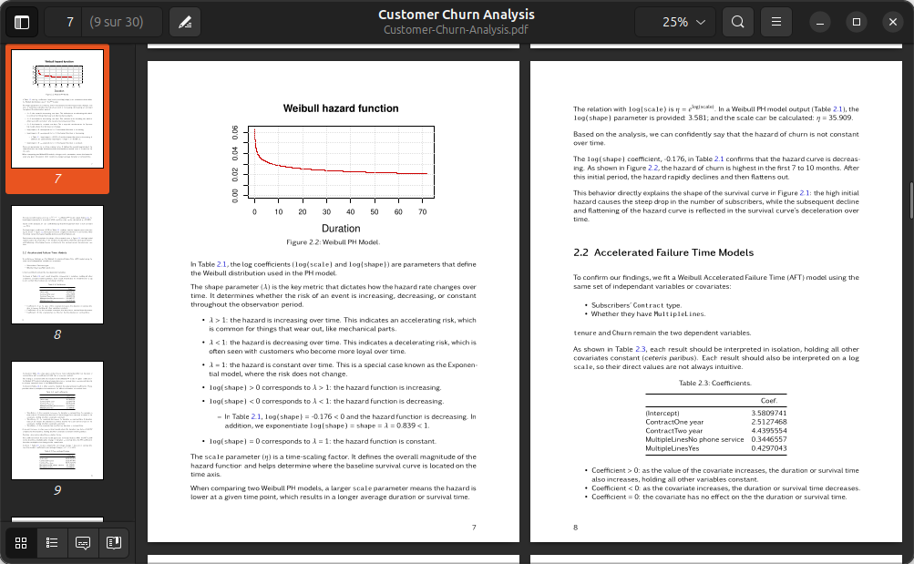

# Demo, Quarto

Book on a statistical technique using R.  
Downloadable **PDF** and **ePub** formats (see above, in 'docs/'). Right click to: <a href="https://ugolabo.github.io/demo_book_quarto_pdf_churn/" target="_blank">HTML format</a>.  
This book is a variation of the report found in the demo_quarto_report_tufte_html_churn repo.  
There are [two ways to publish](#publish) a Quarto document on GitHub.

**Survival analysis** encompasses techniques used across various fields, including medicine, engineering and sociology. These methods allow for estimating patient survival following treatment, predicting the lifespan of equipment for preventive maintenance or analyzing the time until reoffending to refine social reintegration policies. In marketing, survival analysis is specifically used to estimate **customer churn**:

- What is Customer Churn
- Survival Analysis to Predict Customer Churn
    - Proportional Hazards Models like the Weibull PH model
    - Accelerated Failure Time Models like the Weibull AFT model
- Survival Regression to Predict Customer Churn
    - Proportional Hazards Assumption and the Cox PH model 

## Publish

A <a href="https://quarto.org/docs/guide/" target="_blank">Quarto document</a> blends textual content with or without code blocks. The code can be in R, Python, SQL and many other languages. Code is also used to generate tables, charts and maps ; whether static or interactive.

This repo uses a mix of **Option 1 & 2** : assets are at the root and the built site is in /docs. Build and deployment details can be found in the Actions tab above.

| Feature | Option 1 (Full Workflow) | Option 2 (Static HTML) |
| :--- | :--- | :--- |
| **Files on GitHub** | data/ + img/ + renv/ + .github/workflow/publish.yml + .qmd + _quarto.yml + renv.lock + .Rprofile | index.html |
| **Deployment Time** | Slow (plus changes in Settings > Actions) | Fast |
| **Updates** | Automatic upon commit (git push, Add file on GitHub or editing via GitHub Codespaces) | Compile locally, upload index.html to GitHub (git push, Add file on GitHub) |
| **Privacy** | Code and data are on GitHub; the project is reproducible | Only the final result is online; the source project remains private |
| **Heavy Computations** | Limited by GitHub server resources | Unlimited (processed locally) |
| **Advantages** | Workflow automation, online editing | Data privacy, simple result sharing |
| **Web Page Setup** | Settings > Pages, **main branch**, **docs/** | Settings > Pages, main branch, / (root) |
