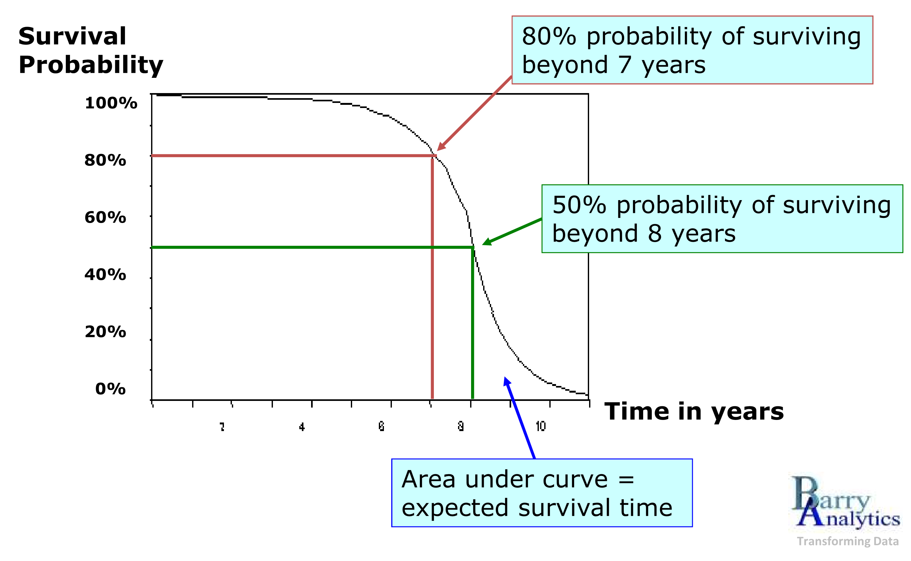

# Introduction to Customer Churn

```{r}
#| label: setup
#| include: false
#setwd("/home/ugo/Documents/CoursR/demo_qmd_churn_tufte_template")
```

```{r}
#| include: false
# Needed modules
library(ggplot2)
library(gridExtra)
library(ggthemes)
library(eha)
library(survival)
```

```{r}
#| include: false
# http://www.altis.com.au/a-crash-course-in-survival-analysis-customer-churn-part-i/

# https://quarto-dev.github.io/quarto-gallery/page-layout/tufte.html
# https://github.com/quarto-dev/quarto-gallery/blob/main/page-layout/tufte.qmd
```

Customer churn is when a customer cancels their subscription or stops using your service. This can happen for many reasons, from being unhappy with the service to finding a better deal with a competitor.

Understanding why customers leave is crucial for a business because a long-term customer base means a stable, predictable stream of revenue. The longer a customer stays subscribed, the more valuable they are.

While this is easy to see in industries like telecommunications, the subscription model is common in many other sectors:

- Insurance: Customers can choose to let their policy lapse.
- Mortgages: Homeowners might pay off their mortgage early.
- Retail: Shoppers may stop making repeat purchases from a mail-order catalog or online store.

A lower churn increases the Customer Lifetime Value (CLV).

Lowering your average churn rate means customers stay subscribed for longer, which directly leads to higher total revenue over time.

This "trickle-down effect" shows how reducing churn boosts your Customer Lifetime Value (CLV), also known as Lifetime Value (LTV):

$$Churn \rightarrow Duration \rightarrow Recurring~revenues \rightarrow$$
$$Recurring~revenues - Recurring~costs = Gross~Contribution~Margin$$
$$Gross~Contribution~Margin - Marketing~costs = Net~margin~for~single~event$$
$$Net~margin~for~single~event \times Expected~number~of~purchase~in~lifetime = $$
$$Accumulated~margin$$

$$Present~value(Accumulated~margin - Acquisition~cost) =$$
$$LTV$$

## Survival Analysis to Predict Customer Churn

Survival Analysis is a powerful statistical method for modeling churn. While traditionally used in medicine to track how long patients "survive" before an event like death, it can be applied to business to understand customer behavior.

By using Survival Analysis, we can gain valuable insights into churn, such as:

- Predicting churn likelihood over time: visualize and understand how the probability of a customer churning changes throughout their subscription.
- Identifying key churn drivers: determine which factors or customer characteristics are most likely to lead to churn.

{fig-caption="Survival Analysis." #fig-survival width=75%}

[Barry Analytics](http://www.barryanalytics.com/Downloads/Presentations/Survival%20Analysis.pdf)

Survival Analysis provides deep insights into customer behavior, allowing us to:

- Estimate customer duration: calculate the average time customers remain subscribed.
- Compare different customer segments: for example, analyze if male and female customers have different average subscription lengths.
- Validate business assumptions: test whether your understanding of the customer lifecycle aligns with real-world data.

Survival regression, a related technique, takes this further by allowing us to model the relationship between churn, time and specific customer characteristics (known as covariates). This helps us identify and quantify the factors that drive churn.

For example, we can use covariates like gender, age and family status to predict the probability that a specific customer segment -- such as "female, non-senior subscribers with dependents" -- will remain a customer for a certain period, say, 24 months.

## A Worked Example

For this analysis, we use a dataset provided by [IBM](https://github.com/IBM/telco-customer-churn-on-icp4d) that details a fictional telecommunications company's subscriber base. The dataset includes information on 7,043 customers, with 20 variables per customer. The majority of these variables are categorical:

- Categorical variables: `gender`, `SeniorCitizen`, `Partner`, `Dependents`, `PhoneService`, `MultipleLines`, `InternetService`, `OnlineSecurity`, `OnlineBackup`, `DeviceProtection`, `TechSupport`, `StreamingTV`, `StreamingMovies`, `Contract`, `PaperlessBilling`, `PaymentMethod` and `Churn`.
- Numeric variables: `tenure`, `MonthlyCharges` and `TotalCharges`.

Our Survival Analysis focuses on the duration of each subscription, or `tenure`. Customers are categorized based on their churn status: `Churn = 1` for those who opted out during the observation period and `Churn = 0` for those who remained subscribed.

```{r}
#| include: false
telco <- readr::read_csv("data/Telco-Customer-Churn.csv")

telco
str(telco)

saveRDS(telco, "data/telco.rds")
```

As shown in @fig-monthly.charges, the distribution of monthly charges indicates that a large portion of the subscriber base pays approximately $20 per month.

```{r}
#| label: fig-monthly.charges
#| fig-cap: "Distribution of Monthly Charges."
hist_1 <- ggplot(telco, aes(x = MonthlyCharges)) +
  geom_histogram(fill = '#377EB8',
                 binwidth = 10) +
  labs(x = 'Monthly Charges',
       y = 'Number of Subscribers') +
  theme_tufte(base_size = 16)
  
hist_2 <- ggplot(telco, aes(x = MonthlyCharges)) +
  geom_histogram(aes(y = ..density..),
                 fill = '#377EB8',
                 binwidth = 10) +
  labs(x = 'Monthly Charges',
       y = 'Density of Subscribers (%)') +
  theme_tufte(base_size = 16)

grid.arrange(hist_1, hist_2, nrow = 2)
```
